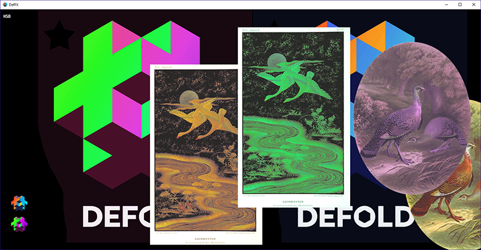
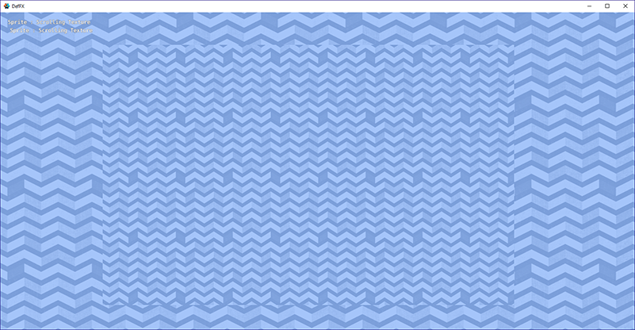
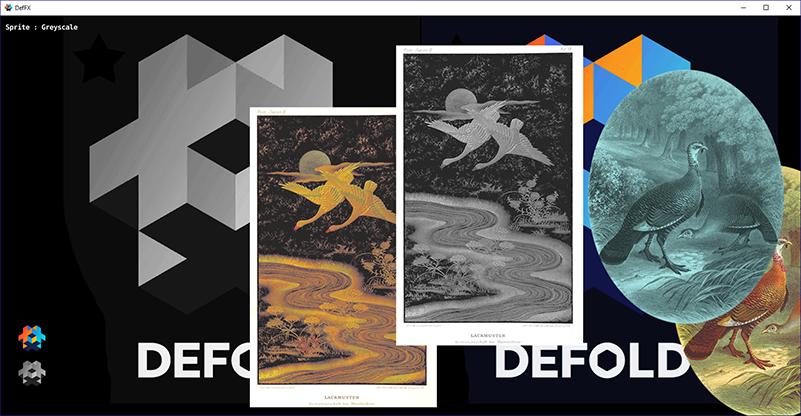
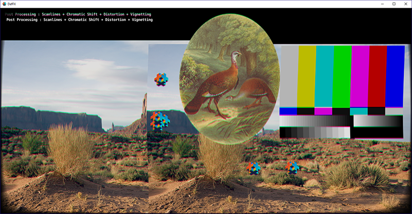
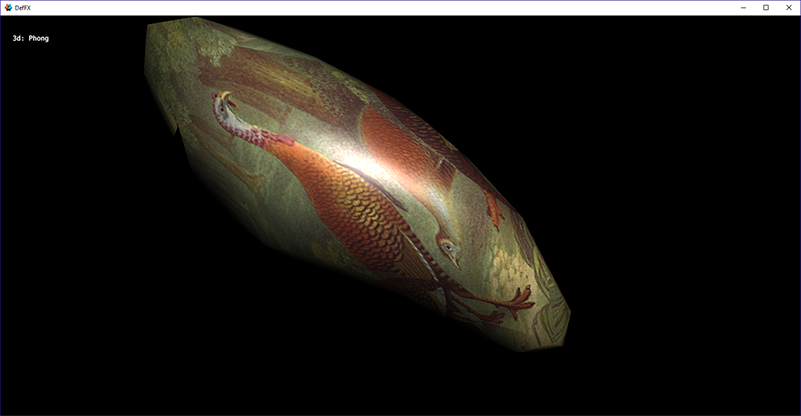
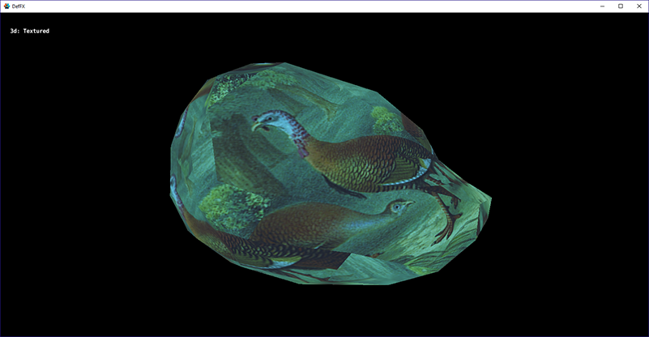
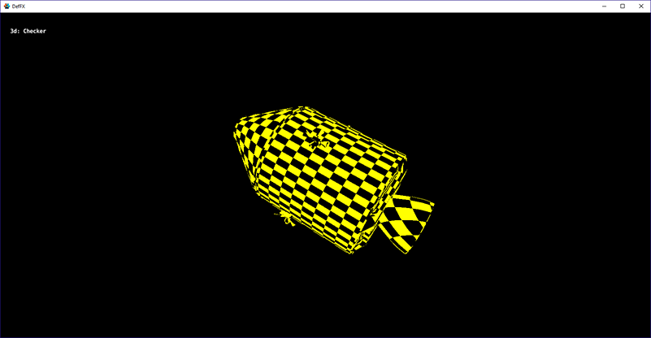

# DefFX
A collection of useful shader effects made ready to be used with the Defold game engine

The purpose of this shader collection is for each to be generally useful, efficient, and to work on Open GL ES 2.0. If you've made a shader which you think would be useful to others please consider contributing it via a pull request. If you can improve an existing shader to add useful features or increase performance please submit your changes!

## Installation
You can use DefFX in your own project by adding this project as a [Defold library dependency](http://www.defold.com/manuals/libraries/). Open your game.project file and in the dependencies field under project add:

	https://github.com/subsoap/deffx/archive/master.zip

Once installed, you can select the materials you wish to use from their associated folders much like you would builtin materials. When you make builds Defold will only package the materials you actually use so do not worry about the extra files. Check your build folder to see for yourself.

Check the source files and examples for full usage.

This collection will likely change over time though we'll try to not break any existing shaders. You may wish to download a static version of these files for use in your project, or create a fork of this project to link to within Defold. At some point, this project will have versioned releases which will be guaranteed to not change and will be easily linked to.

## Expanded Usage
Each shader has different potential usage. There are shaders which could be used for sprites, text, and as post processing effects but are not already setup for each. Making shader versions for features like spine animations is possible. If you would like to help versions specific for each situation please contribute them.

## Gotchas
You may wish to adjust, or merge multiple shader files together for your projects to improve batching and lower draw calls and then make your single shader be able to do multiple effects or single effects at once based on variables sent to the shader programs.

Be careful about breaking batching! If you have a ton of different sprites with various materials set to them at different z positions you may significantly lower your game's performance. This is why you should consider merging multiple shaders with the effects you want possible on your sprites into a single shader for your own use. The process of merging can be complex so ask on the Defold forum if you need assistance.

Some of the examples may have extreme effects to illustrate the range of effects so if you are sensitive to light / have epilepsy be warned!

Sometimes it is better to make pre-baked raster images with some extra polish effects rather than using complex shaders. Performance matters a great deal on mobile and it's easy to kill it with complex shaders.

You may want to add kill switches for certain targets to completely bypass the normal shader code for complex shaders, especially with low FPS. Or to give users config options.

For post processing effects, they can be very expensive for mobile, such as blurs. It would be a good idea to scale down the size of the rendered texture which is then blurred for example. You could example more expensive shaders on desktop targets while enabling less expensive versions for mobile.

## Sprite Ready Shaders
These shaders can be added to sprites. You may need to send data to the shader program over time such as a timer value so check the associated demos for each.

* HSB - Adjust the Hue, Saturation, and Brightness of sprites at runtime.

* Scrolling Texture - Offset / pan / zoom seamless textures.

* Greyscale

* Lighten - useful for making sprites flash when taking damage for example.

* Noise
* Simple Blur
* Directional Blur
* Pixelate

## Post Processing Effect Shaders
These shaders are meant to be applied to render targets. Generally this means you draw your game layers to the render target, and then apply the post processing shader effect. Using these effects requires a custom render script. These shaders require a render script set which has a render target setup.

* Scanlines + Chromatic Shift + Distortion + Vignetting

## 3D Model Shaders
These shaders are meant for use in 3D models. They can be used as foundations for greater effects. These shaders require a render script which supports 3D models.

* Phong

* Textured (unlit / no shading)

* Checkers

## Blending Shaders
Use image editing blending modes between two textures. Could be used for example as additional render target steps to apply textures to entire screen in some way.

* Vivid Light

